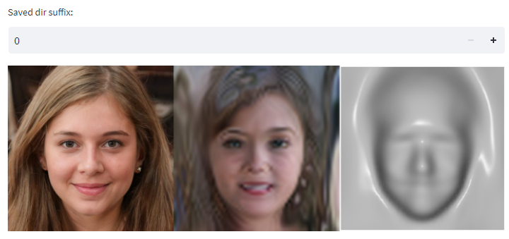
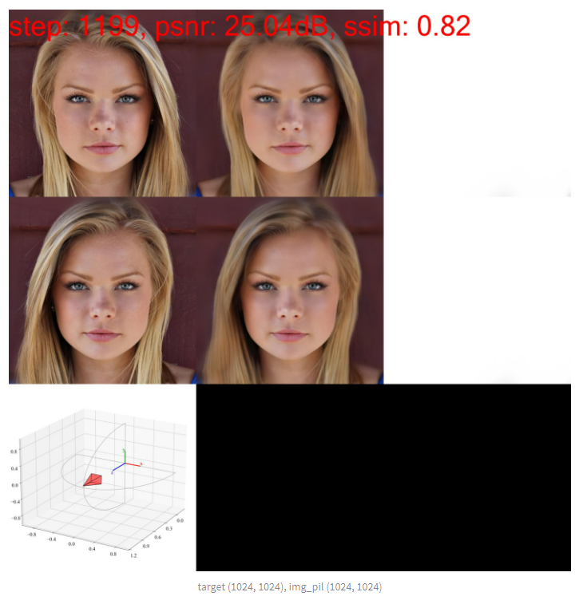
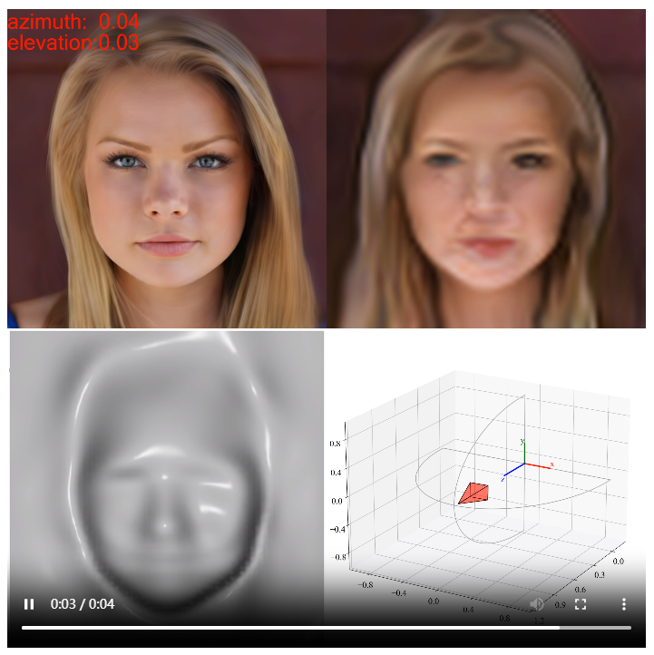
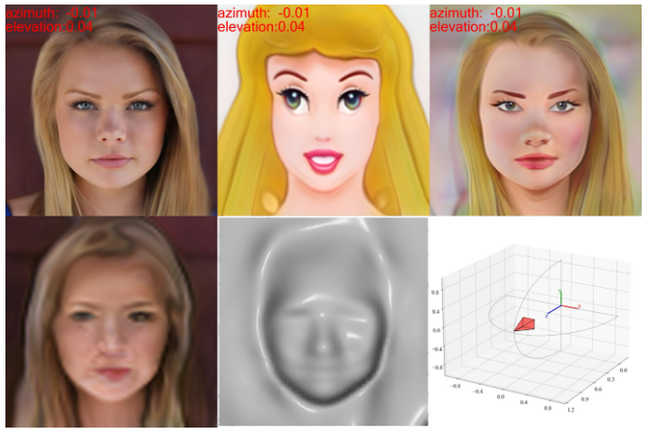
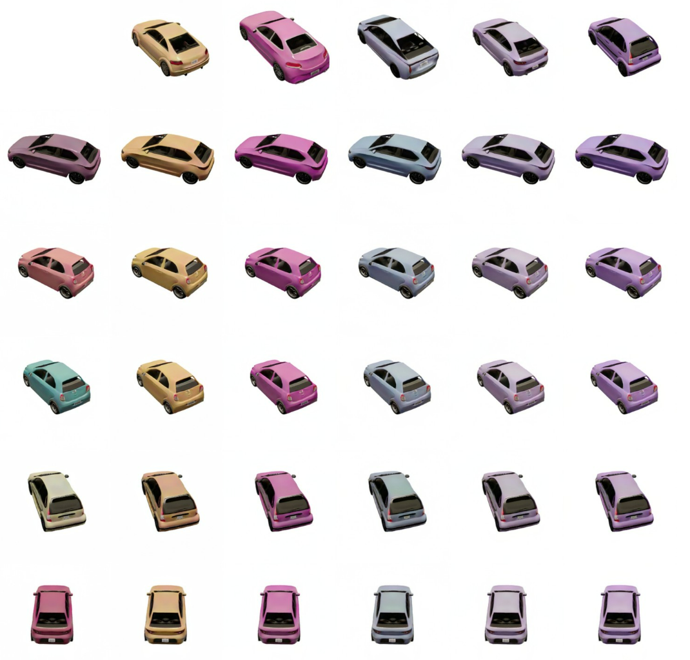
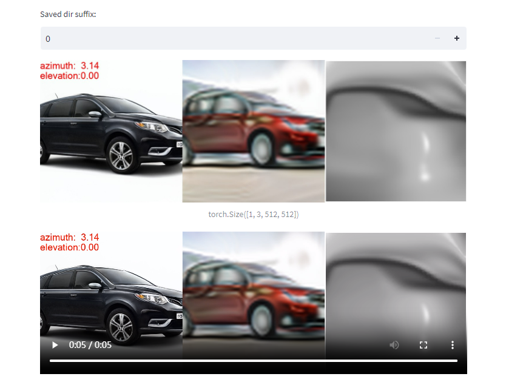
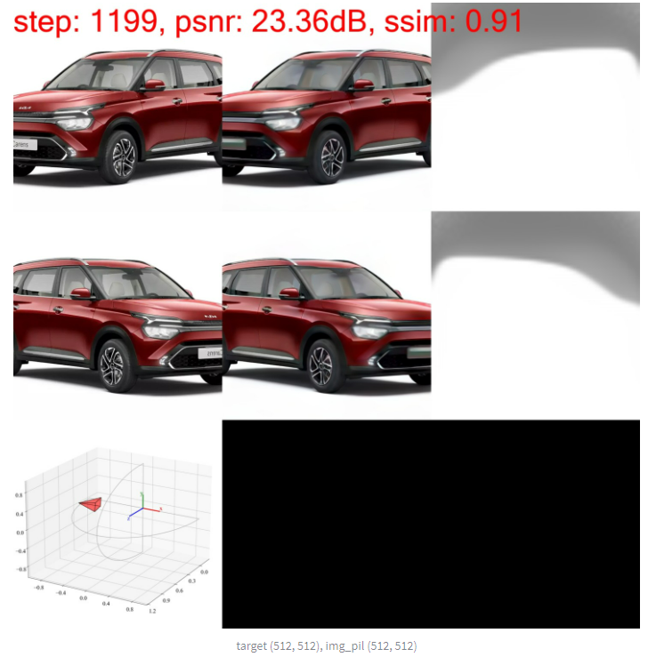
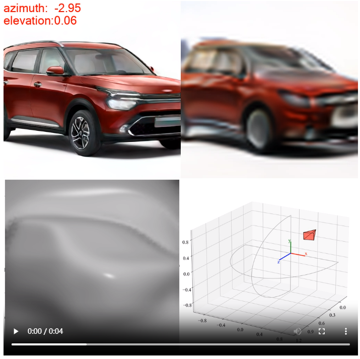

# CIPS-3D++

<details open>
<summary>
  3D-aware GAN inversion
</summary>
  
https://user-images.githubusercontent.com/26176709/171443469-12676d42-c278-49dd-969d-e9fb9e79b453.mp4
</details>

## Preparing envs

```bash
bash exp/tests/setup_env_debug.sh

# Install pytorch3d
git clone https://github.com/facebookresearch/pytorch3d
cd pytorch3d
pip install -e .

```

## Quick start

### Pretrained models

[https://github.com/PeterouZh/CIPS-3Dplusplus/releases/download/v1.0.0/pretrained.zip](https://github.com/PeterouZh/CIPS-3Dplusplus/releases/download/v1.0.0/pretrained.zip)

### Faces

- **Sampling multi-view images**
```bash
export CUDA_VISIBLE_DEVICES=0
export PYTHONPATH=.:exp
python -c "from exp.tests.test_cips3dpp import Testing_train_cips3d_ffhq_v10;\
  Testing_train_cips3d_ffhq_v10().test__sample_multi_view_web(debug=False)" \
  --tl_opts port 8501

```
<details close>
<summary>
  Results
</summary>
<p float="left">

</p> 
</details>

- **Inversion**
```bash
export CUDA_VISIBLE_DEVICES=0
export PYTHONPATH=.:exp
python -c "from exp.tests.test_cips3dpp import Testing_train_cips3d_ffhq_v10;\
  Testing_train_cips3d_ffhq_v10().test__flip_inversion_web(debug=False)" \
  --tl_opts port 8501
```
<details close>
<summary>
  Results
</summary>
<p float="left">

</p> 
</details>

- **Rendering multi-view images**
*Note that in order to render multi-view images, you must first perform inversion (the previous step)*. When you have done the inversion, you can execute the command below to render multi-view images:
```bash
export CUDA_VISIBLE_DEVICES=0
export PYTHONPATH=.:exp
python -c "from exp.tests.test_cips3dpp import Testing_train_cips3d_ffhq_v10;\
  Testing_train_cips3d_ffhq_v10().test__render_multi_view_web(debug=False)" \
  --tl_opts port 8501
```
<details close>
<summary>
  Results
</summary>
<p float="left">

</p> 
</details>

- **Stylization**
```bash
export CUDA_VISIBLE_DEVICES=0
export PYTHONPATH=.:exp
python -c "from exp.tests.test_cips3dpp import Testing_train_cips3d_ffhq_v10;\
  Testing_train_cips3d_ffhq_v10().test__interpolate_decoder_web(debug=False)" \
  --tl_opts port 8501
```
<details close>
<summary>
  Results
</summary>
<p float="left">

</p> 
</details>

- **Style mixing**
```bash
export CUDA_VISIBLE_DEVICES=0
export PYTHONPATH=.:exp
python -c "from exp.tests.test_cips3dpp import Testing_train_cips3d_ffhq_v10;\
  Testing_train_cips3d_ffhq_v10().test__style_mixing_web(debug=False)" \
  --tl_opts port 8501
```
<details close>
<summary>
  Results
</summary>
<p float="left">

</p> 
</details>

- **Time**
```bash
export CUDA_VISIBLE_DEVICES=0
export PYTHONPATH=.:exp
python -c "from exp.tests.test_cips3dpp import Testing_train_cips3d_ffhq_v10;\
  Testing_train_cips3d_ffhq_v10().test__rendering_time(debug=False)"
```

### Cars

- **Sampling multi-view images**
```bash
export CUDA_VISIBLE_DEVICES=0
export PYTHONPATH=.:exp
python -c "from exp.tests.test_cips3dpp import Testing_train_cips3d_compcars_v10;\
  Testing_train_cips3d_compcars_v10().test__sample_multi_view_web(debug=False)" \
  --tl_opts port 8501

```
<details close>
<summary>
  Results
</summary>
<p float="left">

</p> 
</details>

- **Inversion**
```bash
export CUDA_VISIBLE_DEVICES=0
export PYTHONPATH=.:exp
python -c "from exp.tests.test_cips3dpp import Testing_train_cips3d_compcars_v10;\
  Testing_train_cips3d_compcars_v10().test__flip_inversion_web(debug=False)" \
  --tl_opts port 8501
```
*Please note, car inversion is only a preliminary experiment and the results are not stable. The main difficulty lies in accurately estimating the camera's pose for the car. Currently we mitigate this issue by setting an appropriate initial camera pose for the original image and the flipped image. (see the `azim_init`)*
<details close>
<summary>
  Results
</summary>
<p float="left">

</p> 
</details>

- **Rendering multi-view images**
*Note that in order to render multi-view images, you must first perform inversion (the previous step)*. When you have done the inversion, you can execute the command below to render multi-view images:
```bash
export CUDA_VISIBLE_DEVICES=0
export PYTHONPATH=.:exp
python -c "from exp.tests.test_cips3dpp import Testing_train_cips3d_compcars_v10;\
    Testing_train_cips3d_compcars_v10().test__render_multi_view_web(debug=False)" \
    --tl_opts port 8501
```

<details close>
<summary>
  Results
</summary>
<p float="left">

</p> 
</details>


## Training & Evaluation


- Download ffhq dataset (`images1024x1024`) [https://github.com/NVlabs/ffhq-dataset](https://github.com/NVlabs/ffhq-dataset)

```bash
tree datasets/ffhq/images1024x1024
```
```text
datasets/ffhq/images1024x1024
├── 00000
│   ├── 00000.png
│   ├── 00001.png
│   ├── xxx
├── 01000
    ├── 01000.png
    ├── 01001.png
    └── xxx
```

- Preparing lmdb dataset
```bash
bash exp/cips3d/bash/preparing_dataset/prepare_data_ffhq_r1024.sh
```

- Training
```bash
bash exp/cips3d/bash/train_cips3d_ffhq_v10/train_r1024_r64_ks1.sh
```

- Evaluation
```bash
bash exp/cips3d/bash/train_cips3d_ffhq_v10/eval_fid_r1024.sh
```

## Finetuning on Disney Faces

- Download [Disney cartoon](https://mega.nz/file/HslSXS4a#7UBanJTjJqUl_2Z-JmAsreQYiJUKC-8UlZDR0rUsarw) dataset 

```bash
tree datasets/Disney_cartoon/cartoon
```
```text
datasets/Disney_cartoon/cartoon/
├── Cartoons_00002_01.jpg
├── Cartoons_00003_01.jpg
├── xxx
```

- Preparing lmdb dataset
```bash
rm -rf datasets/Disney_cartoon/cartoon/.ipynb_checkpoints/
pushd datasets/Disney_cartoon/cartoon/
mkdir images
mv *jpg images/
popd
bash exp/cips3d/bash/preparing_dataset/prepare_data_disney_r1024.sh
```

- Finetuning
```bash
bash exp/cips3d/bash/train_cips3d_ffhq_v10/finetune_r1024_r64_ks1_disney.sh
```

## Explanation for the name of CIPS-3D

<p float="left">
		
</p>
The generator consists of a NeRF and a 2D MLP. Thus it is conditionally-independent for pixel synthesis. We explain the concept of CIPS from a probabilistic perspective. Let `a` and `b` be two pixels of an image `x` sharing the same style vector `w` but are synthesized individually. According to the directed acyclic graph (DAG) above, we have
<p float="left">
		
</p>
According to the conditional probability formula, we have
<p float="left">
		
</p>
Combining the above formulas, we get
<p float="left">
		
</p>
Hence, `a` and `b` are conditionally independent given `w`.


<!-- ## Citation -->


