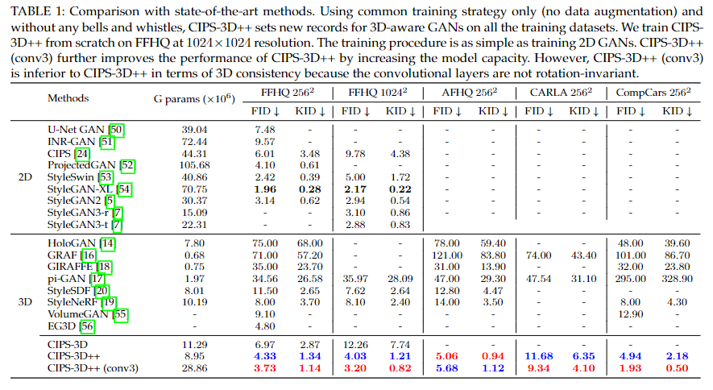

# CIPS-3Dplusplus

This repository will contain the code of the paper,   
[CIPS-3D++: Towards End-to-End 3D-Aware GAN Training, Inversion, and Stylization].

## Demo videos

  Projecting real images

  
https://user-images.githubusercontent.com/26176709/171443469-12676d42-c278-49dd-969d-e9fb9e79b453.mp4

Training from scratch (256x256 resolution)

  
https://user-images.githubusercontent.com/26176709/171319502-3a3d76ee-8a1e-435d-8aa6-7c9a215fe8ed.mp4

  
  

Figure 1 of the paper (Inversion and stylization)

  
https://user-images.githubusercontent.com/26176709/171322193-78dd7cc5-fa48-48cf-a450-26f8fe3171d6.mp4

Figure 5 of the paper (view consistency)

  
https://user-images.githubusercontent.com/26176709/171322549-f033e03e-2b2a-4f08-8f94-056c1b9c03e0.mp4

Figure 6 of the paper (translation and rotation equivariance)

  

https://user-images.githubusercontent.com/26176709/171323755-5d2361d5-f964-4c4c-b397-d257c1df36a1.mp4

Figure 10 of the paper (FlipInversion vs inversion)

  

https://user-images.githubusercontent.com/26176709/171328184-62b0150f-dd25-482c-8ab2-7a1e027d0542.mp4

Figure 21 of the paper (Asymmetric appearance)

  
https://user-images.githubusercontent.com/26176709/171328354-88abcaa5-d148-4bad-8f3b-099f5bd35972.mp4

## Quantitative results

## Citation

## Acknowledgments

